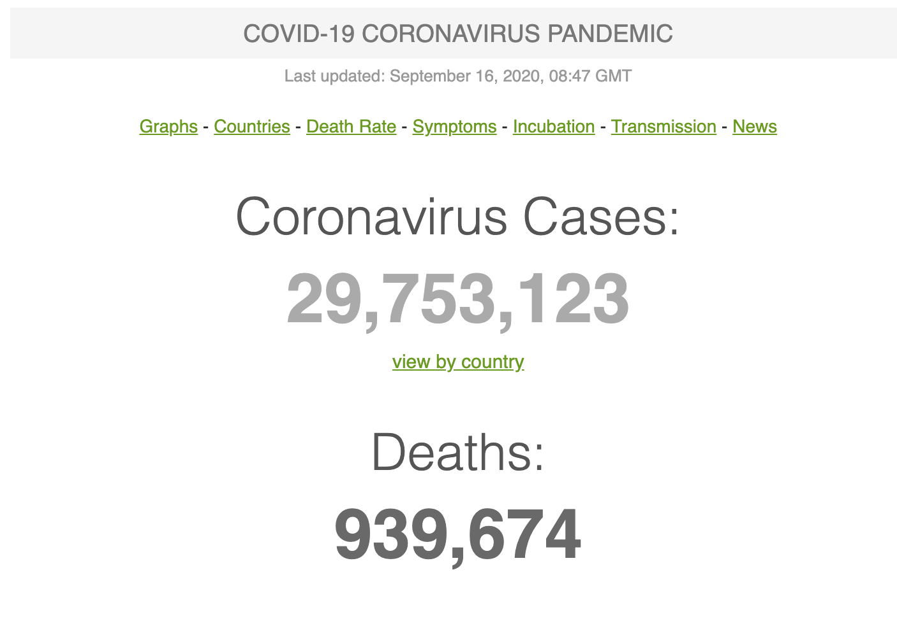

```{r setup, include=FALSE}
knitr::opts_chunk$set(echo = FALSE, message = FALSE, warning = FALSE, fig.pos = 'H', fig.align ='center')
```

```{r load-libraries}
#remotes::install_github("GuangchuangYu/nCov2019")
library(tidyverse)
library(knitr)
library(dplyr)
library(kableExtra)
library(plotly)
library(nCov2019)
library(ggsn)
library(xml2)
library(rvest)
library(RColorBrewer)
library(gganimate)
select <- dplyr::select
```


<center>
"Come on, Wuhan!" Source from Xiaotao Chen.
</center>

"My city was sick, but I still love him."    
I still remember when I read this sentence in January, tears welled up in my eyes. At that time, Wuhan experienced an outbreak of COVID-19, and then COVID-19 spread started throughout other provinces in China. The Spring Festival of 2020 was not be celebrated in a festive atmosphere, but with the fear of COVID-19.   
Today, we have come out of the shadow of COVID-19, and our faces are smiling again. And I want to talk about some stories in Hubei province, what happened there?   


## Data acquisition

### COVID-19 data
```{r covid-history}
# read covid-19 history data
covid_history <- load_nCov2019(lang='en')
cn_dat <- covid_history []
```

```{r cumulative-data}
# read the cumulative data for Huibei province
covid19_tot <- get_nCov2019(lang='en')
hubei <- covid19_tot['Hubei', ] %>%
  filter(name != is.na(name) )
```

The incidence data is obtained from R package `nCov2019`[@ncov] provided by Guangchuang Yu, which contains historical and real-time daily COVID-19 data for China. In this blog, I will focus on Hubei province data, which contains `r nrow(cn_dat)` observations from 2019-12-01 to present.   

### City map data
China city map data is provided by Jinxin Zhang[@citymap], which contains all cities map data in China. Only Hubei map data will be applied in this blog.    
  
```{r hubei-map-data}
#load citymap  
load("data/CityMapDatas.Rda")  
```

### Wikipedia data
```{r lockdown-data}
#scrape lockdown and population information
url_lockdown <- "https://zh.m.wikipedia.org/zh-cn/2019%E5%86%A0%E7%8B%80%E7%97%85%E6%AF%92%E7%97%85%E4%B8%AD%E5%9C%8B%E5%A4%A7%E9%99%B8%E7%96%AB%E5%8D%80%E5%B0%81%E9%8E%96%E6%8E%AA%E6%96%BD"

html_lockdwon <- read_html(url_lockdown)
tbl_lockdown <- html_nodes(html_lockdwon, "table")
lockdown_info <- html_table(tbl_lockdown[[4]], fill = TRUE) 
lockdown_info <-lockdown_info[-c(1:2, 20:21),] 

#rename the columns
names(lockdown_info) = c("city", "province", "start", "end", "level", 
                         "population", "confirmed", "death", "recover")
lockdown_info$city <- trans_city(lockdown_info$city)

```

```{r gdp_data}
#scrape gdp information
url_gdp <- "https://zh.wikipedia.org/wiki/%E6%B9%96%E5%8C%97%E5%90%84%E5%B8%82%E5%B7%9E%E5%9C%B0%E5%8C%BA%E7%94%9F%E4%BA%A7%E6%80%BB%E5%80%BC%E5%88%97%E8%A1%A8"

html_gdp <- read_html(url_gdp)
tbl_gdp <- html_nodes(html_gdp, "table")
gdp_info <- html_table(tbl_gdp[[1]], fill = TRUE) %>% select(1:2)

#rename the columns
names(gdp_info) = c("city", "GDP")
gdp_info$city <- trans_city(gdp_info$city)

```

Lockdown data and GDP data for Hubei province were scraped from Wikipedia.   
Lockdown data[@lockdown] contains `r nrow(lockdown_info)` observations and `r ncol(lockdown_info)` variables for all cities in Hubei on 2020. In this blog, I mainly used city, population, start date and end date of lockdown.  
GDP data[@gdp] include 2018 GDP for `r nrow(gdp_info)` cities in Hubei.  

## Covid-19 in Hubei Province

At the mid-February this year, I heard a sad story from a friend. All four members of his friend's family were diagnosed with COVID-19, including an 8-month-old baby.  

The family comes from Tianmen city, Hubei province, but they were working in Wuhan. They bought train tickets before and planned to return to Tianmen on January 24 to celebrate the Spring Festival with their parents.  At that time, people did not know what was happening, and the whole country was in a festive mood, waiting for the most important festival of the year.  

Since late January, everything has changed. Most of the cities in Hubei province began to lockdown from January 23, as shown in Table \@ref(tab:tab1). All the traffic was regulated, and people had to stay at home. TV stations are no longer the previews of The New Year's party, but the rolling notifications of the epidemic. People's talk is no longer about holidays but of exponentially increasing cases. Everyone is in a state of panic.    
 
```{r tab1}
# select neccessary variables
hubei_dat<- hubei %>% 
  select(name, confirm, dead, heal)

# join data
hubei_info <- lockdown_info %>% 
  full_join(gdp_info, by = "city") %>% 
  full_join(hubei_dat, by = c("city" = "name")) %>% 
  select(-2,-5,-c(7:9)) %>% 
  mutate(`Death rate` = round(dead / confirm,3),
         population = as.numeric(gsub(",","", population))/1000000,
         start = substring(start, 1,10),
         end = substring(end, 1,10),
         # modified the real restrict start date
         start = case_when(city == "Qianjiang" ~ "2020-01-17",
                                  TRUE ~ start),
         `Log GDP` = log(GDP)) %>% 
  arrange(-dead) 

# lockdown table
hubei_info %>% 
  mutate(population = population*1000000) %>% 
  select(city, "start date" = start, "end date" = end, population, "confirmed cases" = confirm) %>% 
  kable(caption = "Lockdown times for each city in Hubei province") %>% 
  kable_styling(bootstrap_options = 
                  c("striped", "condensed"), 
                  position = "center") %>% 
  scroll_box(width = "600px", height = "300px")
```

<br>

Wuhan, as the largest transportation hub in the central city, transported a large number of passengers to other cities before people knew about COVID-19 during the Spring Festival travel rush. No one can know if a passenger travelling with you was infected by the COVID-19. And if you follow the COVID infection curve in Hubei, as shown in the Figure \@ref(fig:dynamic-plot), you will find that the number of confirmed cases showed an exponential increase pattern, which peaked in late February. The widespread transmission of COVID-19 in Hubei province may be positively related to the mass population mobility due to the Spring Festival travel rush in 2020[@jiang2020influence].     

```{r dynamic-plot,fig.cap='The trend for the COVID-19 in Hubei province from 2020-01-01 to 2020-04-15. Black line represents confirmed cases, blue line represents recovered cases, and the red line represents deaths cases.', cache=TRUE}
# only select Hubei province from 2020-01-01 to 2020-04-15
hubei_his_dat<- cn_dat %>% 
  filter(province == "Hubei",
         time >= "2020-01-01" & time <= "2020-04-15") %>% 
  group_by(time) %>% 
  summarise(cum_confirm = sum(cum_confirm),
            cum_dead = sum(cum_dead),
            cum_heal = sum(cum_heal))

# make dynamic plot
h_line <- hubei_his_dat %>% 
  ggplot(aes(x = as.Date(time, "%m/%d/%Y"))) +
    geom_line(aes(y = cum_confirm, color = "Confirmed")) +
    geom_line(aes(y = cum_dead, color = "Deaths")) +
    geom_line(aes(y = cum_heal, color = "Recovered")) +
    transition_reveal(as.Date(time, "%m/%d/%Y")) +
    scale_color_manual(breaks = c("Confirmed", "Deaths", "Recovered"),
                       values = c("black", "red", "steelblue")) +
    labs(title = "COVID-19 in Hubei, China",
         subtitle = "Data from R packages nCov2019",
         x = "Time",
         y = "Count") +
    scale_x_date(date_breaks = "2 week",
                 date_labels = "%b %d") +
    theme_light()

h_line
```


```{r citymap}
# select Hubei
map_hubei<-map %>% 
  filter(NAME_1 == 'Hubei') %>% 
  mutate(name = recode(NAME_2,
                       "Enshi Tujia and Miao" = "Enshi",
                       "Suizhou Shi" = "Suizhou",
                       "Xiangfan" = "Xiangyang"))
```


```{r city-map-data}
hubei_map_data <- data.frame(hubei$name,
                 cut(hubei$confirm, c(0,100,200,500,1000,10000, 60000),
                     labels=c("10~99", "100~199","200~500","500~999","1000~9999","≥10000"),
                     include.lowest=TRUE, right=FALSE))  
names(hubei_map_data) <- c("name", "confirmed")

hubei_map_data <- map_hubei %>%
  left_join(hubei_map_data, by="name") 
```


```{r theme}
# combine themes
theme_p <- theme(axis.title.x=element_blank(),
                  axis.title.y=element_blank(),
                  axis.ticks=element_blank(),
                  axis.text.x = element_blank(),
                  axis.text.y = element_blank(),
                  plot.title = element_text(face = "bold", hjust=0.5),
                  plot.background = element_rect(fill="white"),
                  panel.background = element_rect(fill="white"))
```
   

From Table \@ref(tab:tab1), we can know that Wuhan had the largest number of confirmed cases with `r hubei_info %>% filter(city == "Wuhan") %>%  select(confirm)` in Hubei province, which is the epicentre of the epidemic. But what about other cities in Hubei province? You can get some insights from Figure \@ref(fig:map-plot), the number of confirmed cases in cities bordering Wuhan was higher than in other cities, except for Xiantao and Xianning. Moreover, I found some interesting findings that the number of confirmed cases in Qianjiang, Enshi and Shennongjia is relatively low, especially Shennongjia has the lowest number of confirmed cases with `r hubei_info %>% filter(city == "Shennongjia") %>%  select(confirm)` [\@ref(tab:tab1)] in the whole province.  


```{r map-plot, fig.cap="Map for the cumulative confirmed cases in all cities in Hubei province, divided into six level. The darker the color, the more confirmed cases.", layout="l-page"}
ggplot(hubei_map_data) +
  geom_sf(aes(fill=confirmed, geometry=geometry), color = "white") +
  geom_sf_text(aes(label=name, geometry=geometry), 
               color="black", size = 2) +
  scale_fill_brewer(palette="Blues") +  
  guides(fill=guide_legend(reverse=TRUE))+
  ggtitle("The cumulative cases for COVID-19 in Hubei")+
  theme_p
  
```


One of the main reasons being that they were the two cities with the lowest imported population in Wuhan during the Spring Festival travel rush[@jiang2020influence]. Also, Shennongjia is sparsely populated, with an urban population of only `r hubei_info %>% filter(city == "Shennongjia") %>%  select(population)`. And Qianjiang municipal government began to implement strict travel restrictions on January 17[@chi], six days earlier than the provincial government's lockdown policy, which effectively slowed the spread of the COVID-19[@chang].   
  
In the end, Qianjiang became the first Hubei cities to remove strict travel restrictions. And the Wuhan lockdown officially ended on April 8, 2020.    


<center>
"End of lockdown in Hubei province." Source from Xiaotao Chen.
</center>

## Is COVID-19 mortality related to GDP?

```{r covid, fig.cap= "COVID-19 cases from World, Updated on September 16, 2020, 08:47 GMT. Soruce from Worldometers."}

```

  
As of end of 08:47 GMT on September 16, the global death toll from COVID-19 had reached 939,185, as shown in Figure \@ref(fig:covid). And the death toll in Hubei province was `r sum(hubei_dat$confirm)`. It was heartbreaking to see the statistics, especially when I have to relive people's stories and cold statistics over and over again. It was the first time in my living memory that I had experienced the devastation of an event on a global scale.     

To think and learn from pain, what reflection can death toll bring to us? If we could do it all over again, would we do it better? Next, let's talk about the relationship between GDP, population and death cases, represented by the top 10 cities in deaths outside Wuhan in Hubei Province.   
  
From Figure \@ref(fig:gdp-dead), I found some unexpected facts that the death rate of Yichang, which ranks second in GDP, is as high as 0.04. However, Suizhou, whose GDP is much lower than that of average GDP for Hubei Province, has the same death rate of 0.034 as Xiangyang, whose GDP ranks first. Also, we can find that the mortality rate for Huanggang reached 0.043, which was related to the local poor medical conditions. In the same situation, the GDP level of Ezhou and Jingmen is stuck in the average line, and the mortality rate of these two cities are 0.042 and 0.044, respectively.    
  
```{r gdp-dead, fig.cap="The relationship between GDP, Population and Deaths, represented by the top 10 cities in mortality rate outside Wuhan in Hubei Province. Red line represents the average GDP for Hubei province. The larger the dot, the higher the death rate."}
# select top 10 cities in deaths except for Wuhan
h_10 <- hubei_info %>% filter(city != "Wuhan") %>% head(10) 

# make plot
p<-ggplot() +
  geom_point(data = h_10,
             aes(population, GDP,size=`Death rate`, color=city)) +
  geom_text(data= h_10,
            aes(population, GDP,label=paste(city)), 
            hjust=-0.2, size=3,vjust = -0.5) +
  geom_smooth(data=h_10, 
              aes(population,GDP), 
              method = "lm", 
              se = FALSE, 
              linetype = "dotted", 
              color = "red", 
              size=0.5, alpha=0.3)+
  theme(legend.position="none")+
  theme_classic() +
  scale_size_continuous(range=c(2,11))+
  xlim(c(1,7))+
  xlab("Population(Million)")+
  ylab("GDP(Billion)")+
  annotate(geom = "text", 
           x=5.7, y=2920, 
           label="Hubei province  average GDP", 
           alpha=0.8,size=3) 

hide_legend(p) %>% config(displayModeBar = F)

```

It seems that there is no apparent correlation between GDP and mortality, so I further studied the correlation coefficient, as shown in Figure \@ref(fig:correlation). We can find that the correlation coefficient between GDP and mortality is -0.096, showing a negative correlation, but there is no evidence to establish a strong correlation between the two. That is an interesting finding. In general, we associate GDP with health care, and higher GDP means higher health care expenditure and better health condition. But from the above analysis, I can't prove it. However, due to the lack of historical health expenditure data for each city, I was unable to conduct further analysis. Also, the untimely response at the initial stage of the outbreak may lead to an increase in mortality, which will lead to bias in the analysis.    

```{r correlation, fig.cap = "The plot for the correlation between the death rate and GDP. There is a weak association between them."}
p1<-GGally::ggpairs(data = (hubei_info %>% filter(city != "Wuhan") %>% head(10)), c(9,10),)+
  ggtitle("The correlation between the death rate and GDP")+
  theme_light()

ggplotly(p1)%>% config(displayModeBar = F)
```

To sum up, a better health system and better medical conditions would make a significant contribution to the reduction of mortality[@budhdeo2015changes]. I hope that in the future goverment can pay more attention to health care and invest more in improving the medical system.  


<center>
"Long time no see, my friend!" Source from Xiaotao Chen.
</center>

## Acknowledgments 
Thanks for all contributors for the R packages used in this blog. [@tidyverse] [@plotly] [@ncov] [@ggsn] [@knitr] [@dplyr] [@xml2] [@rvest] [@RColorBrewer] [@kable] [@gganimate]

