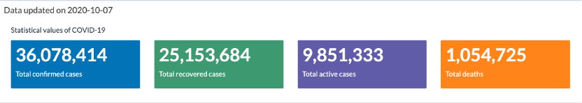
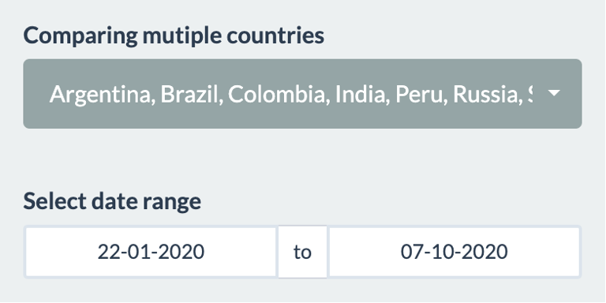
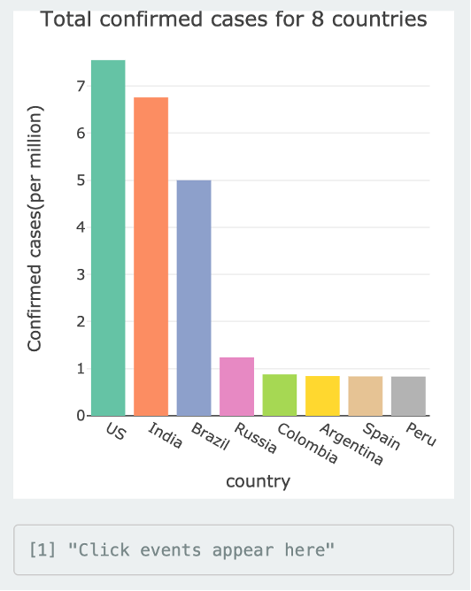
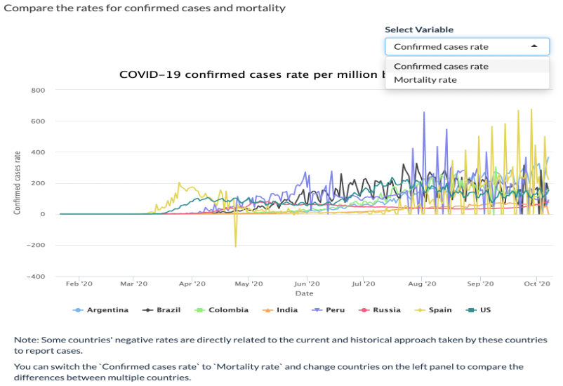

```{r setup, include=FALSE}
knitr::opts_chunk$set(echo = FALSE, message = FALSE, warning = FALSE, fig.pos = 'H', fig.align ='center')
```


With COVID-19 outbreaks occurring worldwide, it would be meaningful to create a web app that displays global COVID-19 data, giving us a clearer picture of the epidemic around the world. Then serendipity stepped in, and I got the opportunity to finish my first Shiny web app in my life to explore and visualize the trends of COVID-19 pandemic over time.  

In the process of making this Shiny app, I have encountered some difficulties and learned a lot in the process. In this blog, I would like to introduce my Shiny web app for COVID-19 Global Cases and review it for self-reflection.  

## Shiny web app for COVID-19 Global Cases

In this section, I will introduce my Shiny web app, data source, and what it does?

### Introduction
This Shiny web app was designed to provide an overview of the COVID-19 epidemic based on real-time global data and give people a picture of the development of COVID-19 in each country. Also, I made some plots used for users to explore and find the differences between countries, and the hope was to provide some insights for users.   
Moreover, the Shiny web app is built with R using the markdown and shiny. You can explore it on the [website](https://cuiping-wei.shinyapps.io/shiny-assessment-cuiping-wei/) and find the codes in [here]( https://github.com/etc5523-2020/shiny-assessment-cuiping-wei).  

### Data source
The incidence data used for this web app is obtained from R package [coronavirus](https://github.com/RamiKrispin/coronavirus)[@coronavirus] provided by RamiKrispin, which contains global COVID-19 data, and the raw data collected and arranged by the Johns Hopkins University Center for Systems Science and Engineering [(JHU CCSE)](https://github.com/RamiKrispin/coronavirus-csv).
Moreover, the population data is obtained from the R package [wbstats](https://github.com/GIST-ORNL/wbstats)[@wb] provided by Jesse Piburn, and the raw data downloaded from the World Bank API.  

### What it does?

This Shiny web app is mainly for updating real-time data of COVID-19, simple visualization and comparison of different countries with graphs and table, rather than comprehensive analyses or model prediction. Next, I'm going to give you a brief overview of what this app does.  

- **Update data**

To obtain the latest data, you can use `update_dataset()` function.  

- **Global COVID-19 overview**

You can find a brief statistical overview for cases on this app.

> 


If you want to see how COVID-19 cases have changed in countries around the world since the outbreak began or over a certain period, you can use Date Slider to select a date range and show the animation on a map. Also, you can choose the variables you want to explore, such as confirmed, death, recovered and active.  

> 

<br>

- **Visualization**

There are three graphs and one table in visualization page, all of which can be updated by user input.
 
> 

<br>

You can select the country you are interested in the above input panel and explore them in the bar chart, which will provide you with a visualization of the total confirmed cases in your chosen country.

> 

<br>

You can click on the above bar chart to see which countries you would like to explore further, and then the following line chart will be updated by your chosen country. The line chart shows the number of confirmed cases, recovered cases, and deaths on a logarithmic scale over time.  

> 

<br>

You can explore the comparison of confirmed rates and mortality rates between different countries.  

> 

<br>

You can find statistical values, the specific number of cases, and the rates of cases in the Summary Table.  

> 


## Self Review

Socrates said, "The unexamined life is not worth living." That is, self-reflection is critical and necessary.   
In this section, I will conduct self-reflection on my Shiny app, find out what I have done well to encourage myself and find out what I can improve to reflect on myself.   

### What did you do well?

- **Appropriate APP design structure**

The overall app structure is clear, and the Map and Statistical Values on the front page provide an overview of COVID-19 development worldwide. The plots and table arrangement for Visualization page has inherent logic relation, and the user can explore them from shallow to profound. The About page provides the reader with background, motivation, and author information about this app.  

- **Good UI design**

Using `shinyDashboard` to separate different topics and using `box` to separate different contents, which provides users with a clean interface. Also, the Visualization page is visually stunning, with `sidebarLayout` separating the user input modules and the text content from the plots and table.  

- **Nice user interaction**

For Map page:
Date Slider allows users to explore COVID-19 cases with a different date range. Also, I added animation on the map that will enable users to observe changes in global COVID-19 cases over time visually.  

For Visulization page:
Country select input module allows users to select the countries they are interested in, and all plots or tables in this page will be updated by user input.  
Date range input module provides an opportunity for users to explore all plots or tables with a different date range.    

- **Detailed explanation within the app**

Users are provided with a detailed explanation within the app on how to use the app and how to understand the output of the charts. This makes it easy for users to use the app and understand the outputs mean.  

- **Appropriate charts**

Both the map and valueBoxes on the Map page and the bar chart, line chart, and table for the Visualization page are logically related and easy to interactive. Also, the plot titles will be changed based on user input or select. Moreover, the summary table with a nice format and text is left-aligned, and numbers are right-aligned appropriately.  
In the end, these charts perfectly serve the app's purpose, providing users with an overview of the global COVID-19.  

- **Appropriate Shiny theme**

A suitable theme can make you Shiny app looks better and give users aesthetic enjoyment.  


### What are the points you can improve on? 

- **Map page**

1. The values of valueBoxs can be optimized to be updated based on the Slider Time Range rather than only total cases;  
2. It will be better to add labels for the points on the map, which can let users know the country, region or province represented by each point.  

- **Visualization page**

1. The bar plot can be modified to show three bar graphs for each country, namely Confirmed, Shuffled and Active. Consistent with the chart variables generated by EVENT_data.  
2. The text output generated by using `event_data` function can be hidden because it does not make much sense.  
3. It will be better to use separate country-input for the summary table，so that the user can select all the countries without affecting the other plots, which can optimize running speed.  

- **About page**

Add the population data source on the data section.  

### What are some things that you’d like to add that’s plausible? 

1. For the Map page, I want to add one more valueBox for counting the number of countries affected by COVID-19.  

2. For the visualization page, I want to add a built-in `selectInput` module to give the user the option to use the logarithm scale or not.  

### What are some things that you’d like to add that cannot be done yet due to limitation in data or technology? 

1. I wanted to explore the relationship between lockdowns and the speed of COVID-19 transmission, but I couldn't find lockdown data for all countries around the world, so the idea failed to materialize.  

2. I wanted to build the app into a multi-function app, which allows users to search Google web content in the search box to obtain external resources and add user comments module in a new page to achieve interaction with users. However, it could not be implemented yet due to the limitation of my code capability.  


